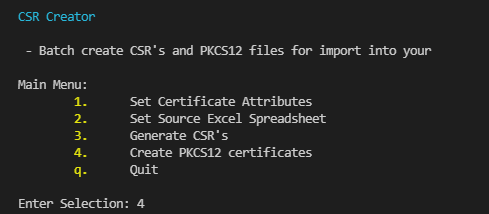

<div id="top"></div>
<!--
*** Thanks for checking out the Best-README-Template. If you have a suggestion
*** that would make this better, please fork the repo and create a pull request
*** or simply open an issue with the tag "enhancement".
*** Don't forget to give the project a star!
*** Thanks again! Now go create something AMAZING! :D
-->


<!-- PROJECT SHIELDS -->
<!--
*** I'm using markdown "reference style" links for readability.
*** Reference links are enclosed in brackets [ ] instead of parentheses ( ).
*** See the bottom of this document for the declaration of the reference variables
*** for contributors-url, forks-url, etc. This is an optional, concise syntax you may use.
*** https://www.markdownguide.org/basic-syntax/#reference-style-links
-->
[![Contributors][contributors-shield]][contributors-url]
[![Forks][forks-shield]][forks-url]
[![Stargazers][stars-shield]][stars-url]
[![Issues][issues-shield]][issues-url]
[![MIT License][license-shield]][license-url]
[![LinkedIn][linkedin-shield]][linkedin-url]


<!-- PROJECT LOGO -->
<br />
<div align="center">
  <a href="https://github.com/gobblegoob/CSRCreator">
    
  </a>

<h3 align="center">CSR Creator</h3>

  <p align="center">
    Batch create CSRs and batch merge signed certs with keys to create PKCS12 files.
    <br />
    <!--<a href="https://github.com/gobblegoob/CSRCreator"><strong>Explore the docs »</strong></a>
    <br />
    <br />
    <a href="https://github.com/gobblegoob/CSRCreator">View Demo</a>-->
    ·
    <a href="https://github.com/gobblegoob/CSRCreator/issues">Report Bug</a>
    ·
    <a href="https://github.com/gobblegoob/CSRCreator/issues">Request Feature</a>
  </p>
</div>


<!-- TABLE OF CONTENTS -->
<details>
  <summary>Table of Contents</summary>
  <ol>
    <li>
      <a href="#about-the-project">About The Project</a>
      <ul>
        <li><a href="#built-with">Built With</a></li>
      </ul>
    </li>
    <li>
      <a href="#getting-started">Getting Started</a>
      <ul>
        <li><a href="#prerequisites">Prerequisites</a></li>
        <li><a href="#installation">Installation</a></li>
      </ul>
    </li>
    <li><a href="#usage">Usage</a></li>
    <li><a href="#roadmap">Roadmap</a></li>
    <li><a href="#contributing">Contributing</a></li>
    <li><a href="#license">License</a></li>
    <li><a href="#contact">Contact</a></li>
    <li><a href="#acknowledgments">Acknowledgments</a></li>
  </ol>
</details>


<!-- ABOUT THE PROJECT -->
## About The Project

<!--[![Product Name Screen Shot][product-screenshot]](https://example.com)-->

<!--Here's a blank template to get started: To avoid retyping too much info. Do a search and replace with your text editor for the following: `gobblegoob`, `CSRCreator`, `twitter_handle`, `linkedin_username`, `email_client`, `email`, `CSR Creator`, `project_description`-->
This project was initially created to reduce clicking on large Cisco SNA (formerly Stealthwatch) deployments, but it can be used to batch create CSR's and create PKCS12 certificates for import for any purpose.

Given it was originally created for a Cisco SNA deployment, the source .xlsx file included also includes a checklist to track activities completed with each SNA cluster member.   Feel free to modify any column other than Column A or B.  SNA's identity certs are generated with a SAN field containing the DNS name of the appliance and a SAN field with the IP Address of the appliance.

<image>

The script will read the hostnames from Column A and create a directory for each host where the certificate keys and CSRs will be kept.

When you receive your signed Base 64 certificates, place them each in their respective directory and run pfxcreator.py to create your pfx files.  You must have a valid Base 64 PEM as well as your key file in the hosts directory for this to work.  The pfx files will be created in their respective directories.

<p align="right">(<a href="#top">back to top</a>)</p>


### Built With
<!--
* [Next.js](https://nextjs.org/)
* [React.js](https://reactjs.org/)
* [Vue.js](https://vuejs.org/)
* [Angular](https://angular.io/)
* [Svelte](https://svelte.dev/)
* [Laravel](https://laravel.com)
* [Bootstrap](https://getbootstrap.com)
* [JQuery](https://jquery.com)

<p align="right">(<a href="#top">back to top</a>)</p>
-->


<!-- GETTING STARTED -->
## Getting Started

Ensure your workstation has OpenSSL installed and up-to-date.
  
Clone the repo.  Install any required libraries you may be missing.

Dependencies:
 - pyOpenSSL==22.0.0
 - openpyxl==3.0.9

<!--
### Prerequisites

This is an example of how to list things you need to use the software and how to install them.
* npm
  ```sh
  npm install npm@latest -g
  ```
-->
### Installation

1. Clone the repo
   ```sh
   git clone https://github.com/gobblegoob/CSRCreator.git
   ```
2. Install the requirements
  ```sh
  pip install -r requirements.txt
  ```
  
<p align="right">(<a href="#top">back to top</a>)</p>


<!-- USAGE EXAMPLES -->

## Usage

In brief: 
1. Add your hostnames and FQDN plus server IP addresses to the SNA Certificate Checklist.xlsx file
2. Run certmanager.py
3. Ensure your certificate attributres are correct either from within the app, or editing the script to change the default settings
4. Generate CSRs by selecting option <b>3</b>.  You can leave the script running or close it when done
5. A directory is created for each server.  Each directory contains a key file and a CSR.
6. Have your CA sign your CSRs and place the signed certificate in its corresponding directory
7. Run certmanager.py and select option <b>4</b> to create your pfx files
8. Import your pfx files 


Modify the included xlsx file SNA Certificate Checklist.xlsx. Fill out column A with your hostnames and column B with your IP addresses.  This will populate the certificate CN and SAN Fields.
 
 

Launch certmanager.py.  You will be granted with a text based interface that will guide you through the process.



<h3>Set Certificate Attributes</h3>
You can set certificate attributes.  If you wish to modify the default set, edit the csr_data dictionary in csrcreator.py.  You also can't directly edit the CN or Key attributes.  The key is defaulted to 4096.

<h3>Set Source Excel Spreadsheet</h3>
 The source excel spreadsheet is simply an excel spreadsheet used as a checklist for certificate activities on a distributed Cisco Secure Network Analytics deployment.
<b>It can be modified for your use as long as the hostnames are in column A.</b>  Row 1 is a header and will not be read into the program.


<h3>Generate CSR's</h3>
Will parse your source list of hostnames and create a directory for each host.
Each directory will hold the CSR file and the Key file.  
<b>Important! </b>ensure that the signed PEM files are Base 64 encoded.
<i>Note:</i> The script will create a json file that will store path and hostname data to account for the time taken to get the certificates signed.  Please don't delete this file till you no longer need it.  It is saved in the root path for the application and will be named csr_list_[DATE].json

<b>The CSR's will be created with the following fields:</b>
 - CN: Appliance FQDN
 - SAN: Appliance FQDN
 - SAN: Appliance IP address

<h3>Create PKCS12 certificates</h3>
When you have your signed PEM files in Base 64 format, place them in the associated host directory with the keys.  This is crucial or the script will fail to create your PKCS12 files.
Each created directory will be parsed and PKCS12 files will be created for each host in their respective directories.  

You will receive output that will let you know if there are any errors.  

You are now ready to install the certificiates where needed.

<h3>Quit</h3>
I'm not sure what this does, but I hope it's not dangerous.


<p align="right">(<a href="#top">back to top</a>)</p>


<!-- ROADMAP -->
## Roadmap

- [x] Use Excel checklist to import host list
- [ ] Include a script for automatically signing CSR's from AD based Certificate Authority
- [x] Allow a user to set their own source spreadsheet
- [x] Allow for the addition of SAN fields and other attributes in CSR
- [ ] GUI
- [ ] Improved error handling


See the [open issues](https://github.com/gobblegoob/CSRCreator/issues) for a full list of proposed features (and known issues).

<p align="right">(<a href="#top">back to top</a>)</p>


<!-- CONTRIBUTING -->
  <!--
## Contributing

Contributions are what make the open source community such an amazing place to learn, inspire, and create. Any contributions you make are **greatly appreciated**.

If you have a suggestion that would make this better, please fork the repo and create a pull request. You can also simply open an issue with the tag "enhancement".
Don't forget to give the project a star! Thanks again!

1. Fork the Project
2. Create your Feature Branch (`git checkout -b feature/AmazingFeature`)
3. Commit your Changes (`git commit -m 'Add some AmazingFeature'`)
4. Push to the Branch (`git push origin feature/AmazingFeature`)
5. Open a Pull Request

<p align="right">(<a href="#top">back to top</a>)</p>


-->
<!-- LICENSE -->
## License

Distributed under the MIT License. See `LICENSE.txt` for more information.

<p align="right">(<a href="#top">back to top</a>)</p>


<!-- CONTACT -->
## Contact


Project Link: [https://github.com/gobblegoob/CSRCreator](https://github.com/gobblegoob/CSRCreator)

<p align="right">(<a href="#top">back to top</a>)</p>


<!-- ACKNOWLEDGMENTS -->
<!--
## Acknowledgments

* []()
* []()
* []()

<p align="right">(<a href="#top">back to top</a>)</p>
-->


<!-- MARKDOWN LINKS & IMAGES -->
<!-- https://www.markdownguide.org/basic-syntax/#reference-style-links -->
[contributors-shield]: https://img.shields.io/github/contributors/gobblegoob/CSRCreator.svg?style=for-the-badge
[contributors-url]: https://github.com/gobblegoob/CSRCreator/graphs/contributors
[forks-shield]: https://img.shields.io/github/forks/gobblegoob/CSRCreator.svg?style=for-the-badge
[forks-url]: https://github.com/gobblegoob/CSRCreator/network/members
[stars-shield]: https://img.shields.io/github/stars/gobblegoob/CSRCreator.svg?style=for-the-badge
[stars-url]: https://github.com/gobblegoob/CSRCreator/stargazers
[issues-shield]: https://img.shields.io/github/issues/gobblegoob/CSRCreator.svg?style=for-the-badge
[issues-url]: https://github.com/gobblegoob/CSRCreator/issues
[license-shield]: https://img.shields.io/github/license/gobblegoob/CSRCreator.svg?style=for-the-badge
[license-url]: https://github.com/gobblegoob/CSRCreator/blob/master/LICENSE.txt
[linkedin-shield]: https://img.shields.io/badge/-LinkedIn-black.svg?style=for-the-badge&logo=linkedin&colorB=555
[linkedin-url]: https://linkedin.com/in/linkedin_username
[product-screenshot]: images/screenshot.png
